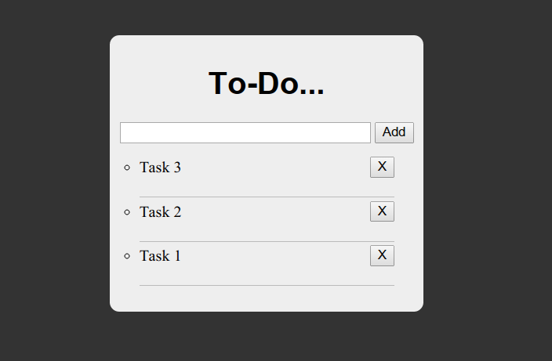

RIPASSO HTML
============


----


tag
---
Un tag HTML rappresenta un elemento del DOM e viene rappresentato nella seguente
forma:

```html
<nomeTag attr1="val1" attr2="val2">childrens...</nomeTag>
```

Dove childrens può esser eun nodo di testo o qualunque altro tag.

N.B. includere sempre il simbolo per la chiusura del tag: `</nomeTag>`

----


Struttura di base HTML
----------------------
```html
<html>
  <head>
    ...
  </head>
  <body>
    ...
  </body>
</html>
```


----


Tag principali
--------------
Contenitore generico:
```html
<div>...</div>
```

Contenitore generico inline:
```html
<span>...</span>
```

Titoli di varie dimensioni (h1 -> h6)
```html
<h1>TITOLO</h1>
```

Paragarfo
```html
<p>testo...</p>
```

Link
```html
<a href="indirizzo">testo</a>
```

Immagine
```
</img>
```


----


Tabelle
-------
```html
<table>
  <tr> // intestazione
    <th>header1</th>
    <th>header2</th>
  </tr>
  <tr> //riga 1
    <td>cella 1</td>
    <td>cella 2</td>
  </tr>
</table>
```


----


Liste
-----
Unordered List
```html
<ul>
  <li>elemento 1</li>
  <li>elemento 2</li>
</ul>
```

Ordered List
```
<ol>
  <li>elemento 1</li>
  <li>elemento 2</li>
</ol>
```

attributo type = 1 | a | A | I | i


----


Attributi comuni
----------------
id
```
<elemento id="nomeId"></elemento>
```

classi
```
<elemento class="classe1 classe2 ..."></elemento>
```


----


Inclusione file esterni
-----------------------
Script JavaScript
```html
< script type="text/javascript" src="script.js">< /script>
```

CSS
```
< link rel="stylesheet" type="text/css" href="stile.css">
```


---


CSS
===
Cascading Style Sheets


----


Struttura istruzioni
--------------------
```css
selettore {
  proprietà1: valore1;
  proprietà2: valore2;
}
```


----


Selettori CSS
----------------
I principali selettori CSS sono:

- tag = elementi tag (valido per tutti i tag body, a, h1, div, etc...)
- .name = elementi con classe name
- `#name` = elemento con id name
- `*` = tutti gli elementi

[Lista completa](http://www.w3schools.com/cssref/css_selectors.asp)


----


Margin & Padding
---------------------
Gli elementi vengono posizionati in base al rettangolo che li contiene.

i margini rappresentano lo spazio da lasciare libero dai bordi del rettangolo verso l'esterno.

Il padding invece è lo spazio tra bordo del rettangolo e i figli contenuti.

```css
margin-top: 10px; margin-right: 11px; margin-bottom: 12px; margin-left: 13px;
```

oppure
```css
margin: 10px, 11px, 12px, 13px;
```


----


Testo
-------
Le principali proprietà che si possono assegnare a elementi testuali sono:
```css
color: nome | hex | rgba // colore del testo
font-size: 16px | 1em
font-weight: normal | bold | bolder | lighter | 100-900
font-family: "Times New Roman", serif | Arial, sans-serif
text-align: left | right | center | justify // allineamento del testo
text-decoration: none | underline | overline | line-through
```


----


Bordi
-----
il bordo del rettangolo contenente un elemento può essere reso visibile
```css
border-width: 1px | thin | medium | thick;
border-style: solid | dotted | dashed | double | groove | ridge | inset | outset;
border-color: blue | hex | rgba();
```


----


Dimensioni
----------
Si possono stabilire le dimensioni dei un elemento tramite height e width
```css
height: 500px | 20% | 3em | auto;
width: 200px;
max-height: 300px;
max-width: 100px;
```


----


Posizione
---------
Esistono 3 tipi di posizionamento nei css:
```css
position: static | relative | absolute | fixed;
```

In caso di posizionamento non statico (naturale) si possono usare le proprietà
top, right, bottom, left per definire i relativi scostamenti

con la prorietà z-index si può definire la "posizione" sull'asse Z


----


Float
-----
Con la proprietà float si può fare in modo che un elmento si posizioni verso
sinistra o destra, permettendo che ai suoi lati possano posizionarsi altri
elementi senza andare a capo (Es. immagini incorniciate da testo)
```css
float: left | right;
```

la prorietà clear fa in modo che un oggetto non possa avere oggetti float alla
sua sinistra, destra o entrambe le parti (obbligando di fatto il layout ad
andare a capo)
```css
clear: left | right | both;
```


---


ESERCIZI
========


----


To-DO List
----------
Realizzare un'interfaccia simile a questa:



----


Fatela funzionare :P
--------------------
Come da titolo utilizzate le tecniche apprese per rendere l'interfaccia
funzionante.

Per lo scopo preparate un nuovo database chiamato todo.
